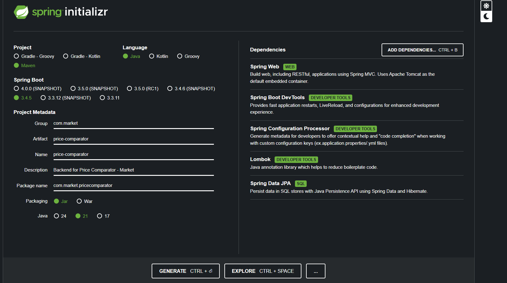

# Price Comparator – Daily Shopping Basket Monitor

A Spring Boot application that compares product prices across multiple Romanian retailers (Lidl, Kaufland, Profi, Altex, eMAG). It supports:
- Historical price tracking
- Best value per unit comparison
- Top and new discounts
- Optimized shopping basket
- Price alerts

---

## Project Setup

This application was generated using [Spring Initializr](https://start.spring.io/).

Spring Initializr configuration:


---

## Project Structure

```
src/
├── main/
│   ├── java/com/market/pricecomparator/
│   │   ├── controller/          # REST controllers for Products and Discounts
│   │   ├── dto/                 # Data Transfer Objects
│   │   ├── model/               # Domain Models (Product, Discount)
│   │   └── service/             # Business Logic (CSV reading, analytics)
│   └── resources/data/          # Sample product and discount CSVs
├── test/                       # JUnit tests (unit and integration)
```

---

## How to Build & Run

### Requirements
- Java 17+
- Maven 3.8+

### Run Application

```bash
mvn clean spring-boot:run
```

Server starts on: `http://localhost:8080`

### Run Tests

```bash
mvn test
```

---

## Assumptions & Simplifications

- CSV files are placed under `src/main/resources/data/`
- Retailers supported: Lidl, Kaufland, Profi, Altex, eMAG
- Dates are inferred from filenames (e.g., `lidl_2025-05-08.csv`)
- No database used; all data is read from CSV for simplicity
- Products are matched by `productId` across stores
- Discounts are loaded from separate CSVs and matched by productId + store

---

## API Endpoints & Usage

### Compare Best Value per Unit

```http
GET /api/products/compare/value-per-unit
```

Returns the best price per unit for each unique productId.

---

### Get Historical Price Data

```http
GET /api/products/history/{productId}
```

**Query Params**: `store`, `brand`, `category` (optional)  
**Example**: `/api/products/history/P001`

---

### Optimize Shopping Basket

```http
POST /api/products/basket/optimize
```

**Request Body**:
```json
{
  "productIds": ["P001", "P002", "A004"]
}
```

Returns the cheapest available option per product across all stores and dates.

---

### Check Price Alert

```http
POST /api/products/alert
```

**Request Body**:
```json
{
  "productId": "P001",
  "targetPrice": 10.00,
  "store": "Lidl"
}
```

Returns entries where price is below threshold.

---

### Top Discounts

```http
GET /api/discounts/top?limit=5
```

Returns the top N discounts sorted by percentage.

---

### New Discounts

```http
GET /api/discounts/new
```

Compares current discounts (e.g., `2025-05-21`) with a past date (e.g., `2025-05-01`) and returns only new ones.

---

## Sample Data

CSV files are located under `src/main/resources/data/`:
- `lidl_2025-05-01.csv`, `profi_2025-05-08.csv`, etc.
- `altex_discounts_2025-05-21.csv`, `emag_2025-05-01.csv`, etc.

Use realistic data for:
- Matching products across stores
- Historical comparisons
- Detecting discounts

---

## Tests

Includes:
- Unit tests for services
- Integration tests for all major endpoints (`/alert`, `/basket/optimize`, `/discounts/top`, etc.)

### Code Coverage

The test suite achieves **97% instruction coverage** as shown below:

| Before Improving Tests | After Improving Tests |
|------------------------|------------------------|
|  |  

---

## How to Generate Coverage Reports

```bash
mvn clean test
mvn jacoco:report
```

Then open the generated HTML report at:

```html
target/site/jacoco/index.html
```

